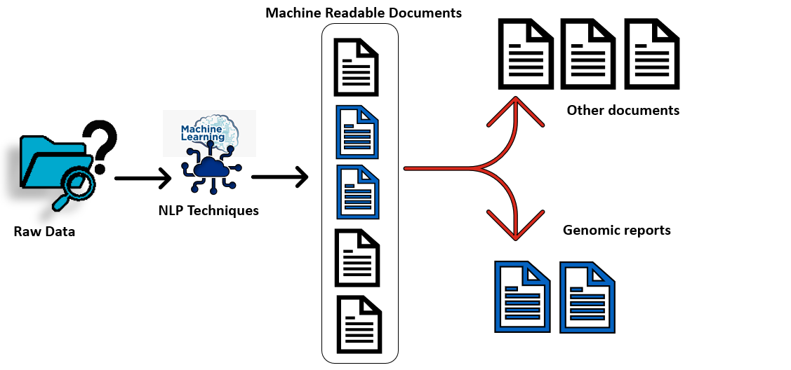
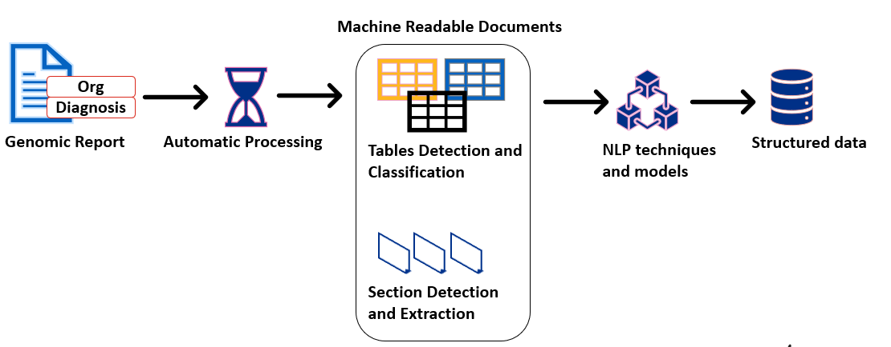

 

# An Automated Genomic Information Finder to Extract Data from Reports

### 🚀 Introduction
 
This package contains the source code for an automated pipeline that uses a hybrid approach of combining rules and pretrained NLP models to extract gene variants, related information of these variants and any gene panel information present within the genomic test reports. 

#### Step 1 : Document Classification

Documents are classified as machine-readable or not, if machine-readable these are further classified as genomic reports specific to a particular set of diagnosis or not. 



#### Step 2: Genomic Data Extraction

Genomic reports filtered using the document classification step are further processed for extracting structured information such as variant names, it’s corresponding information (if applicable) such as Transcript Reference ID, DNA Change ID, Amino Change ID, Inheritance, Zygosity and list of genes tested. 



*This is an initial PoC pipeline developed using existing NLP packages, pretrained models that can work on limited compute* 


## 📝 Requirements
```bash
1. poetry
2. git
```
Use pip to install the above.

## 📚 Installations

### Run without docker

To install and run it locally on your laptop without a docker/podman container,

1. Clone the repository

2. Setup a virtual environment with python=">=3.10,<3.11" and use the following command to install packages via poetry.
  ```shell
   poetry install
   ```
3. Create a ```data``` folder and please add pretrained nlp models in a sub-folder ```nlp_models``` folder from [biobert-nli](https://huggingface.co/gsarti/biobert-nli) and [multi-qa-MiniLM-L6-cos-v1](https://huggingface.co/sentence-transformers/multi-qa-MiniLM-L6-cos-v1). Please add all the PDFs in the sub-folder ```raw_data``` folder for processing. 

4. Change the ```LOCAL_FILES``` as True in ```pretrained_word_embeddings\config.py``` 

#### Getting Started
5. Run the following steps:
```bash

poetry run run_process --pipeline_steps <num> --storage_path <path_to_folder> 
```
<num> represents the options where num=3 performs both document classification and data extraction. <path_to_folder> represents the path to the data/ folder containing the raw_data/ folder.

This will install the packages provided in the pyproject.toml and runs the process on the documents present in the raw_data folder.

The output folder has the following structure:
```bash
[folder_name]
- mr_data
- intermediate_output
- gold_standard_form_output
- extracted_data
```
### Run using docker
1. Clone the repository
2. Use the Dockerfile script to create the container image

```
docker build -t document_processing .
```
#### Usage

1. Run the docker container
```
docker run --volume $<path_to_data>:/code/data/raw_data <container_name> --pipeline_steps 3 --storage_path "/code/"
```

Results get stored within the container.

For the purpose of running our code, we have a dummy report in the ```sample_data``` folder.

##  🤝 Acknowledgements
* DRE team
* Alexandros Zenonos (Code Reviewer)
* Helena Goncalves - Annotation Expert
* Dr. Natassa Spiridou 

##  🤝 Contributors
* Dr. Pavi Rajendran
* Sebin Sabu

For any queries, please contact us via email pavithra.rajendran@gosh.nhs.uk

## Citing & Authors

If you find this repository helpful, feel free to cite our publication [ GIF: An Automated Genomic Information Finder to Extract Data from Reports](to be updated):

```
@inproceedings{
    title = "GIF: An Automated Genomic Information Finder to Extract Data from Reports",
    author = "Rajendran, Pavithra and Zenonos, Alexandros and Sabu, Sebin and Spiridou, Anastasia and Goncalves, Helena Spiridou and Laskowski, Nastazja and Key, Daniel and Patel, Shiren and Pope, Rebecca and Sebire, Neil",
    pages = "4642 - 4648"
    booktitle = "Volume 392: ECAI 2024",
    year = "2024",
    publisher = "Frontiers in Artificial Intelligence and Applications",
    url = "[10.3233/FAIA241059](https://ebooks.iospress.nl/doi/10.3233/FAIA241059)",
}
```

### 📃 Licenses

Code in this repository is covered by the MIT License and for all documentation the [Open Government License (OGL)](https://www.nationalarchives.gov.uk/doc/open-government-licence/version/3/) is used.

Copyright (c) 2024 Crown Copyright


